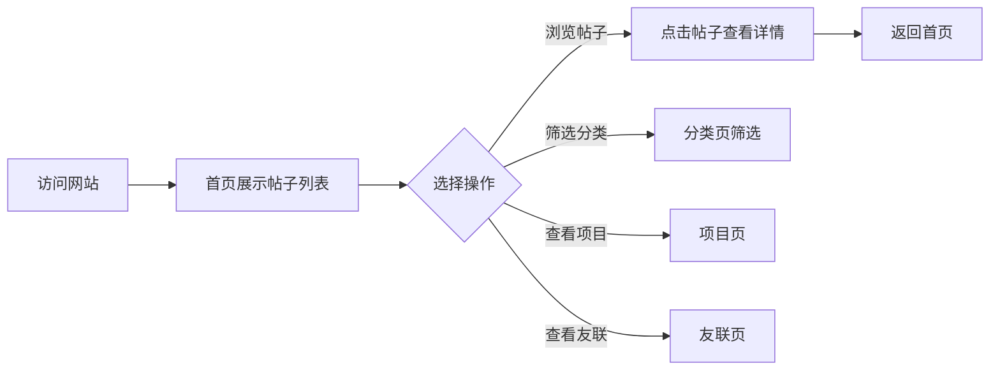

## 1. Product Overview
C++ 求助论坛是一个基于 GitHub Pages 的静态网站，用于帮助开发者发布和浏览 C++ 项目相关的求助帖子。用户可以通过创建 Markdown 文件来发布新的求助内容，界面美观且支持作者头像显示。

## 2. Core Features

### 2.1 User Roles
| Role | Registration Method | Core Permissions |
|------|---------------------|------------------|
| Contributor | GitHub account | Create posts via MD files |
| Viewer | No registration | Browse posts and categories |

### 2.2 Feature Module
1. **首页**: 导航栏、帖子列表、搜索功能
2. **分类页**: 按分类筛选帖子
3. **项目页**: 展示相关项目链接
4. **友联页**: 展示友情链接
5. **帖子详情页**: Markdown 内容渲染、作者信息

### 2.3 Page Details
| Page Name | Module Name | Feature description |
|-----------|-------------|---------------------|
| 首页 | 导航栏 | 顶部固定导航，包含首页、分类、项目、友联链接，配置文件管理 |
| 首页 | 帖子列表 | 展示所有求助帖子，支持分页，显示标题、摘要、作者、时间、标签 |
| 首页 | 搜索框 | 支持按标题和内容搜索帖子 |
| 分类页 | 分类列表 | 展示所有分类，点击筛选对应帖子 |
| 项目页 | 项目卡片 | 展示推荐项目，包含名称、描述、链接 |
| 友联页 | 友情链接 | 展示友情链接列表，包含名称和链接 |
| 帖子详情页 | 内容渲染 | 将 MD 文件内容渲染为 HTML |
| 帖子详情页 | 作者信息 | 显示作者头像、名称、发布时间 |

## 3. Core Process
用户访问首页 → 浏览帖子列表 → 点击帖子查看详情 → 如需发布新帖，在仓库中创建新 MD 文件

## 4. User Interface Design

### 4.1 Design Style
- **主色调**: 深蓝色系 (#1e3a5f)，配合青色点缀 (#00d4ff)
- **按钮风格**: 圆角矩形，悬停时背景渐变
- **字体**: 标题使用 JetBrains Mono，正文使用 Inter
- **布局风格**: 卡片式布局，响应式设计
- **图标**: 使用 Lucide 图标库

### 4.2 Page Design Overview
| Page Name | Module Name | UI Elements |
|-----------|-------------|-------------|
| 首页 | 导航栏 | 固定顶部，白色背景，深色文字，hover 效果 |
| 首页 | 帖子卡片 | 白色卡片，圆角阴影，显示标题、摘要、标签、作者信息 |
| 首页 | 搜索框 | 居中搜索，带放大镜图标 |
| 帖子详情页 | 内容区 | Markdown 渲染，代码高亮，图片展示 |
| 帖子详情页 | 作者信息 | 圆形头像，用户名，发布时间 |

### 4.3 Responsiveness
- Desktop-first 设计
- 移动端自适应：导航栏变为汉堡菜单，卡片单列显示

### 4.4 Animation
- 页面加载时卡片渐入动画
- 悬停时卡片上浮阴影效果
- 导航栏滚动时背景变化
