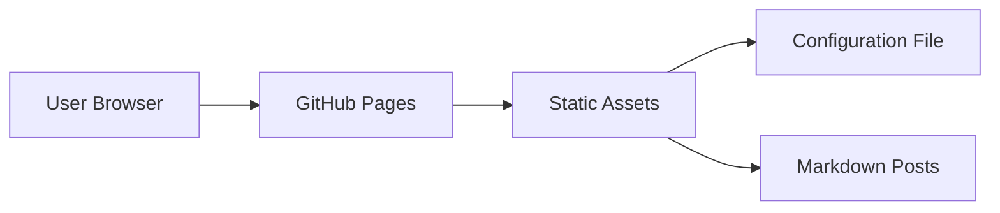

## 1. Architecture Design


## 2. Technology Description
- Frontend: React@18 + TailwindCSS@3 + Vite
- Markdown Rendering: react-markdown + remark-gfm
- Code Highlighting: rehype-highlight
- Icons: lucide-react
- Deployment: GitHub Pages

## 3. Route Definitions
| Route | Purpose |
|-------|---------|
| / | 首页，展示帖子列表 |
| /category/:name | 分类页，按分类筛选帖子 |
| /projects | 项目页，展示推荐项目 |
| /friends | 友联页，展示友情链接 |
| /post/:id | 帖子详情页，展示完整内容 |

## 4. Configuration Structure

### 4.1 Navigation Config (`config/nav.json`)
```json
{
  "navItems": [
    { "name": "首页", "href": "/" },
    { "name": "分类", "href": "/category/all" },
    { "name": "项目", "href": "/projects" },
    { "name": "友联", "href": "/friends" }
  ]
}
```

### 4.2 Friends Config (`config/friends.json`)
```json
{
  "friends": [
    { "name": "示例网站", "url": "https://example.com", "description": "网站描述" }
  ]
}
```

### 4.3 Projects Config (`config/projects.json`)
```json
{
  "projects": [
    { "name": "项目名称", "url": "https://github.com/user/repo", "description": "项目描述" }
  ]
}
```

### 4.4 Categories Config (`config/categories.json`)
```json
{
  "categories": [
    { "name": "编译问题", "icon": "code" },
    { "name": "运行错误", "icon": "bug" },
    { "name": "性能优化", "icon": "zap" }
  ]
}
```

## 5. Post Structure

### 5.1 Markdown Post Format
每个帖子为一个 MD 文件，位于 `posts/` 目录：

```markdown
---
title: 帖子标题
author: 作者名称
avatar: https://avatar-url.com/avatar.jpg
category: 分类名称
tags: [标签1, 标签2]
date: 2024-01-01
---

帖子内容...
```

### 5.2 Post Metadata Schema
| Field | Type | Description |
|-------|------|-------------|
| title | string | 帖子标题 |
| author | string | 作者名称 |
| avatar | string | 作者头像 URL |
| category | string | 分类名称 |
| tags | string[] | 标签列表 |
| date | string | 发布日期 (YYYY-MM-DD) |

## 6. Project Structure
```
├── src/
│   ├── components/
│   │   ├── Navbar.tsx
│   │   ├── PostCard.tsx
│   │   ├── PostList.tsx
│   │   └── Footer.tsx
│   ├── pages/
│   │   ├── Home.tsx
│   │   ├── Category.tsx
│   │   ├── Projects.tsx
│   │   ├── Friends.tsx
│   │   └── PostDetail.tsx
│   ├── config/
│   │   ├── nav.json
│   │   ├── friends.json
│   │   ├── projects.json
│   │   └── categories.json
│   ├── posts/
│   │   ├── post1.md
│   │   └── post2.md
│   ├── utils/
│   │   └── markdown.ts
│   ├── App.tsx
│   ├── main.tsx
│   └── index.css
├── index.html
├── package.json
├── vite.config.ts
├── tailwind.config.js
└── tsconfig.json
```

## 7. Build and Deployment
- Development: `npm run dev`
- Build: `npm run build`
- Deploy: GitHub Actions 自动部署到 GitHub Pages
